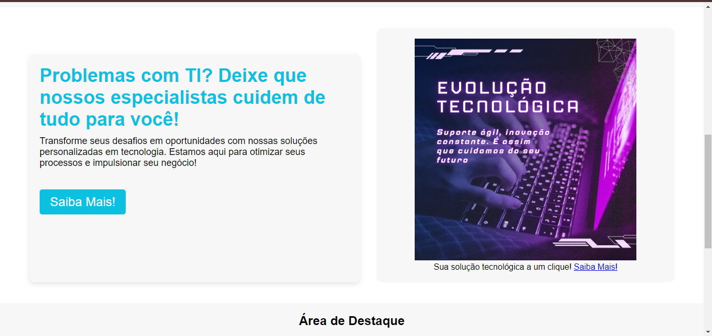

# Gran Tech - Front-End Jr Project

A fictional website for Gran Tech, built with HTML, CSS, and JavaScript to showcase front-end development skills.

# README Contents:

- [Summary](#summary)
	- [About the project](#about)
	- [Preview](#preview)
	- [Screenshot](#screenshot)
- [My code](#codes)
	- [HTML](#html)
	- [CSS](#css)
	- [Javascript](#js)
- [Process](#process)
	- [Designed](#designed)
- [Autor](#autor)
	- [Link](#link)
	
## summary

### about

This project is a fictional website developed for the company Gran Tech, created as part of a personal Front-End Jr project. The template was implemented using technologies such as HTML, CSS, and JavaScript, with custom images designed in Canva. The goal of the development was to improve technical skills and demonstrate creative ability in designing modern and functional web interfaces. The website was created for personal purposes and serves as an example of front-end development.

### preview

 

### screenshot

Home Page

 

Exclusive Featured Page

 

Featured Area and Footer Page

## codes

### html

Code HTML

 

### css

Code CSS

 

### js

Code Js

 

## process

### designed

- Semantic HTML5;
- CSS priorities;
- Javascript Functions;
- Canva Design.

## autor

## link
Click here to acess the project
[Gran Tech](https://patrickcaramico.github.io/Gran-Tech_Project/)
